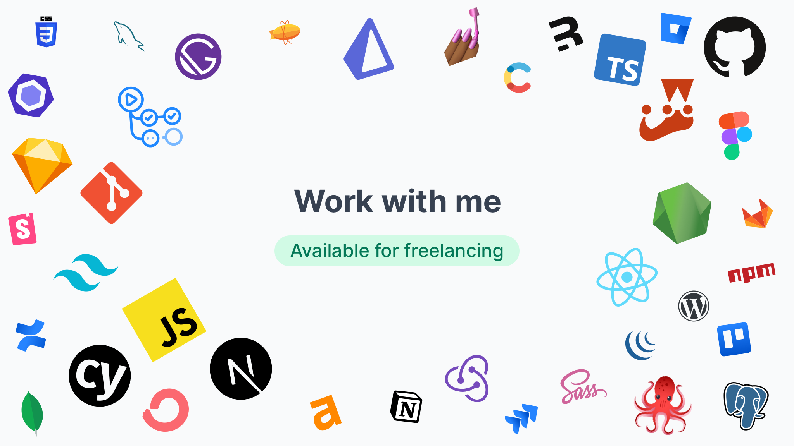

### Hey what’s up?

🙋‍♂ I’m Dom, a designer, developer, and maker. You can usually find me pushing pixels, committing code, and making things happen on the web. My approach is pragmatic and collaborative: I want to leave every project better than I found it, which includes the people I work with. Teaching everything I know is what gets me out of bed each morning. Empowering others to get their work done both better and faster is deeply ingrained in everything I do.

🏢 Under the company [fn teach](https://github.com/fnteach), I develop, operate and sell digital products and platforms. I also teach you how to do the same with courses that show you how I do what I do.

🤝 I am **available for limited freelancing/consulting engagements**. Reach out via hello@fnteach.com and tell me what you’re looking to build.

🎥 When I’m not working with clients, you can catch me build in public over on Twitch about twice a week. I livestream on all things design, development, and ultimately building a business out of the two, usually every Tuesday and Thursday at 10 a.m. CEST. Follow me on Twitch to get notified when I go live: https://twitch.tv/domhabersack
